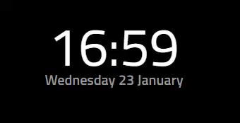
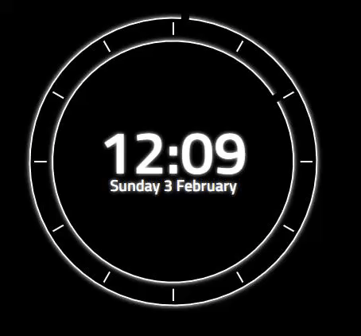
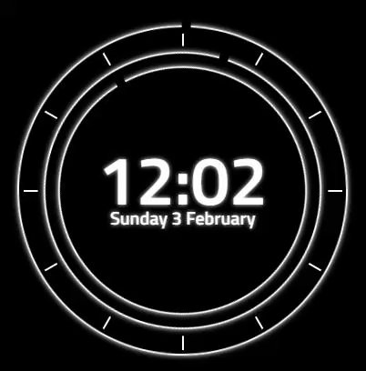
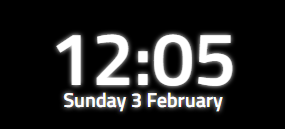

# MMM-iClock - Live Clock module with updates on the minute every minute for MagicMirror²

This is a module for the [MagicMirror²](https://github.com/MichMich/MagicMirror/).

Recreated the default clock module, updates occur every minute instead of every second.
# Updates
I have made the clock somewhat more customisable. You can now choose if you want the clock to update each second or minute.
Redesigned the module adding an analogue clock around the digital version.
Users can choose the size of the analogue display and the color for all elements contained inside.
Users can also choose if they want the digital time displayed (0 = no display, 1 = permanent display, 2 = show for 5 seconds on every minute.)
Choose if you want the analogue clock displayed at all, and finally if you would like all elements to have a glow effect or not.

Reccommended settings for displaying only the digital time would be to alter size to "0px".

## Preview







## Installation
	
Installation is very simple, just clone the git into your modules directory then add the module to your config.

```shell
cd ~/MagicMirror/modules
git clone https://github.com/aSeann/MMM-iClock
```

## Using the module

To use this module, add the following configuration block to the modules array in the `config/config.js` file:
```js
var config = {
    modules: [
        {
		module: "MMM-iClock",
		position: "top_center",
		config:{
			seconds: false,		//	true = update every second, false = update every minute.
			size: "350px",		//	Size of analogue clock, also changes margin for digital clock.
			color: "white",		//	Can be hex, rgb, rgba or color name.
			digital: 1,		//	0 (no display), 1 (permanent display) or 2 (show for 5 seconds on every miniute).
			analogue: true,		//	false (no display), true (permanent display).
			glow: true,		//	false (no display), true (permanent display).
		}
	},
    ]
}
```
