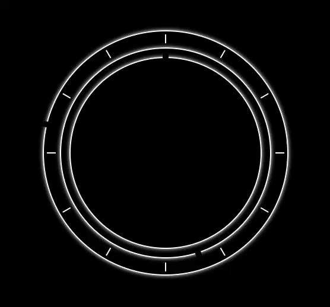

# MMM-iClock - Live Clock module with updates on the minute every minute for MagicMirror²

This is a module for the [MagicMirror²](https://github.com/MichMich/MagicMirror/).

Recreated the default clock module, updates occur every minute instead of every second.
It's fairly basic at the moment, I have created a small script to update on on the exact minute instead of each minute after your page has loaded.
I have styled it like the time and date display on iPhone lock screens because it's what im used to (hence the name).


## Preview




## Installation
	
Installation is very simple, just clone the git into your modules directory then add the module to your config.

```shell
cd ~/MagicMirror/modules
git clone https://github.com/aSeann/MMM-iClock
```

## Using the module

To use this module, add the following configuration block to the modules array in the `config/config.js` file:
```js
var config = {
    modules: [
        {
			  module: "MMM-iClock",
			  position: "top_center"
		  },
    ]
}
```
